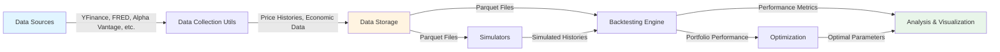
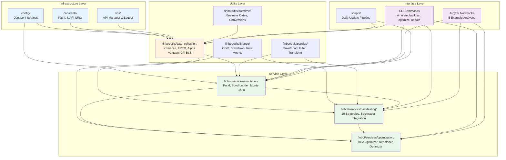

# Finbot

**Financial data collection, simulation, and backtesting platform for quantitative analysis**

[](https://github.com/jerdaw/finbot/actions/workflows/ci.yml)
[](https://codecov.io/gh/jerdaw/finbot)
[](https://www.python.org/downloads/)
[](https://docs.astral.sh/uv/)

## Overview

Finbot is a comprehensive platform for quantitative financial analysis, combining:

- **Data Collection**: Automated pipelines for Yahoo Finance, FRED, Alpha Vantage, Google Sheets, Shiller datasets, and BLS
- **Simulation**: Realistic modeling of leveraged ETFs, bond ladders, indexes, and Monte Carlo scenarios
- **Backtesting**: 10 pre-built strategies with Backtrader integration and comprehensive performance metrics
- **Optimization**: Grid-search DCA optimizer and portfolio rebalancing tools
- **Analysis**: Research-grade documentation with statistical significance testing

### Why Finbot?

**Problem**: Testing investment strategies requires stitching together disparate tools, managing data inconsistencies, and writing repetitive boilerplate code.

**Solution**: Finbot provides a unified platform where you can:
- Fetch historical data from 6+ sources with a single function call
- Simulate leveraged funds back to 1950 with realistic cost modeling (fees, spreads, borrowing costs)
- Backtest any strategy with one class definition
- Optimize portfolios across multiple dimensions (allocations, durations, intervals)
- Generate publication-ready research with example notebooks

**Use Cases**:
- Test rebalancing strategies (60/40, All-Weather, etc.)
- Evaluate leveraged ETF performance vs unleveraged alternatives
- Model bond ladder mechanics across different yield environments
- Optimize DCA timing and allocation ratios
- Generate Monte Carlo risk scenarios for retirement planning

### Project History

This repository consolidates three years of development across three repositories (2021-2024). See [CHANGELOG.md](CHANGELOG.md) for detailed history and [ADR-001](docs/adr/ADR-001-consolidate-three-repos.md) for consolidation rationale.

## Quick Start

```bash
# Install dependencies
make install

# Set environment
export DYNACONF_ENV=development

# Run all code quality checks
make check

# Run tests
make test

# Run daily data pipeline
make run-update
```

**Makefile Commands:**
- `make help` - Show all available commands
- `make install` - Install dependencies with uv
- `make test` - Run all tests with verbose output
- `make check` - Run all code quality checks (lint, format, type, security)
- `make clean` - Remove cache files and build artifacts
- `make all` - Run full CI pipeline (check + test)

## Prerequisites

| Requirement | Minimum Version |
| --- | --- |
| **Python** | 3.11+ |
| **uv** | 0.6+ |

### Docker (Alternative)

Run finbot without installing Python or uv:

```bash
# Build image
make docker-build

# Check data freshness
make docker-status

# Run daily update pipeline
make docker-update

# Run any CLI command
make docker-run CMD="simulate --fund UPRO --start 2020-01-01"
```

Data is persisted in a Docker volume (`finbot-data`). API keys are loaded from `finbot/config/.env`.

## Usage

### Backtesting

```python
from finbot.services.backtesting.backtest_runner import BacktestRunner
from finbot.services.backtesting.strategies.rebalance import Rebalance

runner = BacktestRunner(
    price_histories={"SPY": spy_df, "TLT": tlt_df},
    start=None, end=None, duration=None, start_step=None,
    init_cash=100000,
    strat=Rebalance,
    strat_kwargs={"rebal_proportions": (0.6, 0.4), "rebal_interval": 63},
    broker=bt.brokers.BackBroker, broker_kwargs={},
    broker_commission=FixedCommissionScheme,
    sizer=AllInSizer, sizer_kwargs={},
    plot=False,
)
stats = runner.run_backtest()
```

### Fund Simulation

```python
from finbot.services.simulation.fund_simulator import fund_simulator

# Simulate a 3x leveraged S&P 500 fund
fund_df = fund_simulator(
    price_df=sp500_price_history,
    leverage_mult=3,
    annual_er_pct=0.91 / 100,
    percent_daily_spread_cost=0.015 / 100,
    fund_swap_pct=2.5 / 3,
)
```

### Monte Carlo Simulation

```python
from finbot.services.simulation.monte_carlo.monte_carlo_simulator import monte_carlo_simulator

trials_df = monte_carlo_simulator(equity_data=spy_df, sim_periods=252, n_sims=10000)
```

## Settings Configuration

| Variable | Required | Description |
| --- | --- | --- |
| `DYNACONF_ENV` | Yes | `development` or `production` |
| `ALPHA_VANTAGE_API_KEY` | For data collection | Alpha Vantage API access |
| `NASDAQ_DATA_LINK_API_KEY` | For data collection | Nasdaq Data Link access |
| `US_BUREAU_OF_LABOR_STATISTICS_API_KEY` | For data collection | BLS API access |
| `GOOGLE_FINANCE_SERVICE_ACCOUNT_CREDENTIALS_PATH` | For data collection | Google Sheets service account |

## Development

### Using Makefile (Recommended)

```bash
make lint       # Run ruff linter with auto-fix
make format     # Format code with ruff
make type       # Run mypy type checker
make security   # Run bandit security scanner
make test       # Run all tests
make test-cov   # Run tests with coverage report
make check      # Run all checks (lint + format + type + security)
make all        # Run full CI pipeline (check + test)
```

### Direct uv Commands

```bash
uv run ruff check . --fix   # Lint
uv run ruff format .        # Format
uv run mypy                 # Type check
uv run pytest               # Test
```

Run `make help` to see all available commands.

## Architecture

### High-Level Data Flow



### Architecture Diagram



### Package Structure

| Layer | Purpose |
| --- | --- |
| `config/` | Dynaconf-based environment configuration, settings accessors |
| `constants/` | Application constants, path definitions, API URLs |
| `libs/` | API manager with rate limiting, queue-based async logger |
| `finbot/utils/` | 176-file utility library (data collection, finance, pandas, datetime, plotting, etc.) |
| `finbot/services/simulation/` | Fund, index, bond ladder, Monte Carlo simulators |
| `finbot/services/backtesting/` | Backtrader-based backtesting engine with 10 strategies |
| `finbot/services/optimization/` | DCA and rebalance portfolio optimizers |
| `finbot/cli/` | Click-based CLI with 4 commands (simulate, backtest, optimize, update) |
| `scripts/` | Daily data update pipeline |
| `notebooks/` | 5 example Jupyter notebooks with analysis |
| `docs/` | Research papers, ADRs, planning documents |

See [docs/adr/](docs/adr/) for architectural decision records and [finbot/utils/README.md](finbot/utils/README.md) for utility library overview.

## Example Notebooks

Explore comprehensive analyses demonstrating all major features:

1. **[Fund Simulation Demo](notebooks/01_fund_simulation_demo.ipynb)** - Compare simulated vs actual ETF performance (SPY, UPRO, TQQQ)
2. **[DCA Optimization Results](notebooks/02_dca_optimization_results.ipynb)** - Find optimal portfolio allocations and timing
3. **[Backtest Strategy Comparison](notebooks/03_backtest_strategy_comparison.ipynb)** - Compare all 10 strategies with risk-return analysis
4. **[Monte Carlo Risk Analysis](notebooks/04_monte_carlo_risk_analysis.ipynb)** - Portfolio risk scenarios and VaR analysis
5. **[Bond Ladder Analysis](notebooks/05_bond_ladder_analysis.ipynb)** - Bond ladder construction and yield curve modeling

Each notebook includes:
- Setup and data loading
- Multiple analysis sections with interactive visualizations
- Key findings with actionable insights
- Statistical validation and next steps

## Research Documentation

Three comprehensive research papers (docs/research/):

- **[Leveraged ETF Simulation Accuracy](docs/research/leveraged-etf-simulation-accuracy.md)** - Tracking error analysis and methodology validation
- **[DCA Optimization Findings](docs/research/dca-optimization-findings.md)** - Optimal allocations across market regimes
- **[Strategy Backtest Results](docs/research/strategy-backtest-results.md)** - 10 strategies compared with statistical significance testing

## Limitations and Known Issues

**Important:** Finbot is a research and educational tool. All models make simplifying assumptions and past performance does not guarantee future results.

See **[docs/limitations.md](docs/limitations.md)** for comprehensive documentation of:
- Survivorship bias and its impact
- Simulation assumptions and trade-offs
- Data quality and coverage limitations
- Overfitting risks in strategy optimization
- Tax and cost considerations not modeled
- Known bugs and workarounds

**Key Takeaways:**
- Use results as inputs to decisions, not sole decision-maker
- Combine quantitative analysis with qualitative judgment
- Always consult qualified financial professionals
- This is not financial advice

## Contributing

Contributions welcome! See [CONTRIBUTING.md](CONTRIBUTING.md) for:
- Development setup
- Code quality standards
- Pull request process
- Issue templates

## License

MIT License - see [LICENSE](LICENSE) for details.

## Citation

If you use Finbot in academic research:

```bibtex
@software{finbot2024,
  author = {Dawson, Jeremy},
  title = {Finbot: Financial Data Collection, Simulation, and Backtesting Platform},
  year = {2024},
  url = {https://github.com/jerdaw/finbot},
  version = {1.0.0}
}
```
